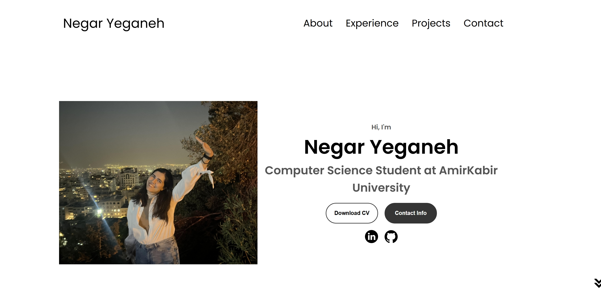

# 🌐 Personal Portfolio Website

This project is a **responsive personal portfolio website** implemented using **HTML, CSS, and JavaScript**.  
The goal of the project is to create an online resume and portfolio that showcases an individual’s **profile, skills, experience, and projects** in a clean and professional format.  
It is deployed on **GitHub Pages**, making it easily accessible and shareable.

---
## ✨ Features

- **Responsive Design** – Adapts to desktop, tablet, and mobile devices.  
- **Dual Navigation** – Desktop navbar and animated mobile hamburger menu.  
- **Profile Section** – Includes introduction, resume download, and social links.  
- **About Section** – Education and background information.  
- **Experience Section** – Technical skills grouped with proficiency levels.  
- **Projects Section** – Project previews with GitHub and Live Demo links.  
- **Contact Section** – Simple contact info with email and LinkedIn.  
- **Clean Animations** – Smooth transitions and hover effects.  
- **Optimized for GitHub Pages** – Fast, static, and easy to deploy.
---

## 🔎 Project Overview

The portfolio is designed to be **minimal, modern, and responsive**. It follows a **section-based architecture**, where each part of the website is dedicated to a specific purpose:

1. **Navigation (Desktop & Mobile):**  
   - Implemented with a standard navigation bar for desktop.  
   - A **hamburger menu** is included for mobile, using JavaScript to toggle visibility.  
   - Smooth transitions and CSS transformations are used to animate menu icons.  

2. **Profile Section:**  
   - Contains a profile image, a short introduction, and role description.  
   - Buttons allow users to download a CV or jump to the contact section.  
   - Social media icons link directly to LinkedIn and GitHub profiles.  

3. **About Section:**  
   - Highlights education and professional background.  
   - Uses a **flexbox-based layout** with responsive design for text and images.  

4. **Experience Section:**  
   - Structured as skill cards with icons and proficiency levels.  
   - Divided into **frontend** and **backend/other** skill groups.  
   - Built using semantic `<article>` elements for better accessibility.  

5. **Projects Section:**  
   - Displays example projects with preview images.  
   - Each project card contains two buttons: **GitHub repository** and **Live Demo**.  
   - Layout uses **flexbox and responsive containers** for alignment.  

6. **Contact Section:**  
   - Simple contact information with email and LinkedIn links.  
   - Icons are included for quick recognition.  

7. **Footer:**  
   - Repeats navigation links for usability.  
   - Includes copyright notice.  

---

## 🏗️ Implementation Details

### 1. HTML Structure
- Written in **semantic HTML5** for accessibility and SEO.  
- Sections are wrapped in `<section>` tags with IDs for navigation.  
- `<nav>` elements are used for both desktop and mobile menus.  
- Buttons and links are used instead of forms to keep the website lightweight.  

### 2. Styling with CSS
- **Flexbox** is the main layout tool, ensuring alignment across different screen sizes.  
- **Media queries** handle responsiveness:
  - Up to **1400px** for large screens.  
  - Up to **1200px** for tablets.  
  - Up to **600px** for small mobile devices.  
- **Transitions and hover effects** are applied to buttons, links, and icons.  
- Consistent design using **Google Fonts (Poppins)**.  

### 3. JavaScript Functionality
- JavaScript is minimal, focusing only on the **hamburger menu toggle**.  
- A function `toggleMenu()` adds/removes the `.open` class, which triggers CSS transitions.  
- No external libraries or frameworks are used, keeping the site **lightweight and fast**.  

### 4. Responsiveness
- The project heavily relies on **CSS Media Queries** to adjust layout.  
- Images and text containers resize dynamically for different devices.  
- Navigation adapts to smaller screens with a slide-down menu.  

### 5. Deployment on GitHub Pages
- Since it is a **static website**, no backend is required.  
- Deployment is done via GitHub Pages: simply push to the `main` branch and enable Pages in settings.  
- The site is hosted at `https://negarys.github.io/NegarYS-Portfolio/`.  

---

## 📸 Screenshots

### 🖥️ Desktop View


### 📱 Mobile View


---

## 🌟 Key Highlights

- **Lightweight and Fast:** No external JS frameworks, only pure HTML, CSS, and JS.  
- **User-Friendly Navigation:** Dual menu system ensures usability on both desktop and mobile.  
 
- **Accessible:** Semantic tags and descriptive alt attributes improve accessibility.  
- **Easily Customizable:** All personal information (name, resume, projects, skills) can be edited directly in `index.html`.  

---

## 🎨 Customization Guide

You can easily personalize this portfolio:

- **Name, Title, and Intro:** Update in `index.html` under the `#profile` section.  
- **Profile Picture:** Replace `assets/profile-pic.png`.  
- **Resume File:** Replace `assets/resume-example.pdf` with your own CV.  
- **Skills:** Update the `#experience` section with your own technologies.  
- **Projects:** Modify the `#projects` section with new images, GitHub links, and live demo URLs.  
- **Contact Info:** Update email and LinkedIn in the `#contact` section.  
- **Colors & Fonts:** Edit in `style.css`.  

---


## 🌍 Deployment (GitHub Pages)

1. Push your project to GitHub.  
2. Go to **Repository Settings → Pages**.  
3. Under **Source**, select **`main` branch / root**.  
4. Save – your portfolio will be live at:  
   ```
   https://username.github.io/portfolio-website/
   ```
---

## 📜 Conclusion

This project demonstrates how a **simple yet powerful portfolio** can be built using core web technologies.  
It emphasizes **clean design, responsive layout, and practical usability** while avoiding unnecessary complexity.  
By deploying on GitHub Pages, the portfolio becomes a **free, shareable, and professional online presence** for developers and professionals.  

---
 


